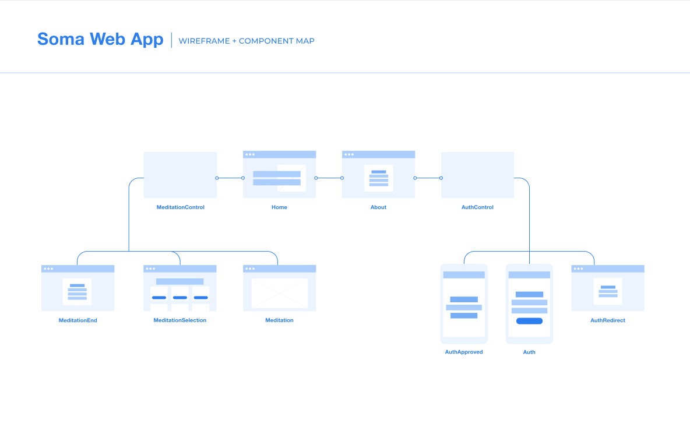

# _Soma_

#### _A visual meditation app using React and ThreeJS , 10/1/20_

#### By _**Hannah Beinstein**_

## Description
Soma is a visual meditation/mindfulness web app that uses accelerometer data from a user's phone to track their breath rate and generate a responsive visual. By connecting the graphics to the biometric information retrieved by the program every few seconds, I'm be able to alter the scene depending on how fast/slow the user’s heart/breath rate is. The goal is to create a visual that reacts in real-time to how relaxed the user is, and provide the user with a focus during their meditation.

## App Wireframe
See a component wireframe for this project below:

## Support and contact details

_Please contact me through my Github or at hannah.beinstein@gmail.com._

## Technologies Used

* _HTML_
* _CSS_
* _JavaScript_
* _Webpack_
* _React_
* THREEjs

Copyright (c) 2020 **_Hannah Beinstein_**